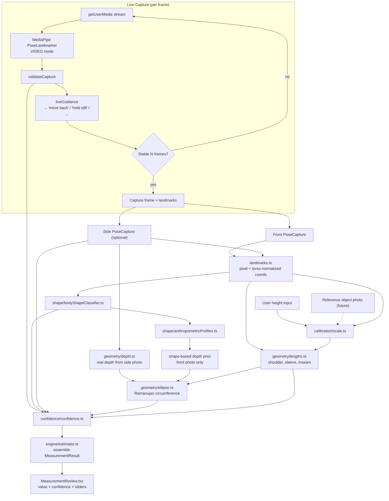
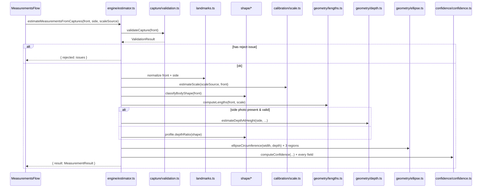

# Measurement Engine — Architecture (v2)

Status: **design for review — nothing in this document is implemented yet.**

This replaces the single-file heuristic in `lib/poseMeasurements.ts` with a
modular pipeline. Scope note up front, so nothing below overclaims: BlazePose
gives 33 skeletal joint keypoints (x, y, visibility) and nothing else — no
silhouette, no clothing boundary, no true depth. Every module past
`landmarks.ts` is custom geometry/heuristics built on top of that, not a
capability MediaPipe itself provides. Where a claim in the original spec
isn't achievable with pose landmarks alone (oversized-clothing detection,
true 3D reconstruction), this document says so explicitly rather than
building something that looks like it works but doesn't.

---

## 1. Architecture diagram



---

## 2. Directory structure

```
lib/measurement/
  types.ts                       # shared types, no logic
  landmarks.ts                   # BlazePose indices, pixel conversion, torso-normalization

  capture/
    validation.ts                # per-photo capture-quality checks (also reused live, per-frame)
    liveGuidance.ts               # per-frame landmarks+validation → single guidance string (pure, stateless)

  calibration/
    referenceObjects.ts          # known real-world dims (credit card, A4, phone) + detection contract
    scale.ts                      # height-based OR reference-object-based → px-per-cm, incl. tilt compensation

  shape/
    bodyShapeClassifier.ts       # torso-normalized ratios → BodyShape + classification confidence
    anthropometricProfiles.ts    # per-shape width→depth priors (replaces flat CHEST_K/WAIST_K/HIP_K)

  geometry/
    depth.ts                      # side-photo real depth-at-height
    ellipse.ts                    # Ramanujan ellipse circumference (pure math)
    lengths.ts                    # direct pixel-distance fields: shoulder, sleeve, inseam, neck proxy

  confidence/
    confidence.ts                 # per-field 0–100 confidence composition

  engine/
    estimator.ts                  # ONLY module that imports all the others — public API surface
    interfaces.ts                 # strategy interfaces (see §12) for future ML swap-in

  ml/
    regressionEstimator.ts        # NOT implemented — documents the interface a trained model would satisfy

  index.ts                        # public barrel export

  __tests__/
    ellipse.test.ts
    scale.test.ts
    bodyShapeClassifier.test.ts
    validation.test.ts
    lengths.test.ts
    confidence.test.ts
    estimator.test.ts             # integration-style, synthetic landmark fixtures

components/measurement/
  LiveCameraCapture.tsx           # owns camera stream + rAF loop + MediaPipe VIDEO mode + stability timer
  CaptureGuidanceOverlay.tsx      # presentational: silhouette outline, guidance text, hold-still ring
  MeasurementReview.tsx           # presentational: value + confidence indicator + correction sliders

components/MeasurementsFlow.tsx   # orchestrates: intro → capture front → capture side → review → save
```

---

## 3. Responsibility of every module

| Module | Responsibility | Does NOT do |
|---|---|---|
| `types.ts` | All shared types/interfaces, reference-object real-world dimensions | Any computation |
| `landmarks.ts` | Pixel conversion, distance, midpoints, torso-relative normalization | Any measurement or domain assumption beyond "this is a human skeleton" |
| `capture/validation.ts` | Geometric capture-quality checks on one frame (posture, cropping, crossed legs, arm occlusion, rotation, resolution, missing landmarks) | Clothing/silhouette analysis (not possible from joints alone — see §7) |
| `capture/liveGuidance.ts` | Turns one frame's validation result into one human-readable instruction | Stability-over-time bookkeeping (that's stateful, lives in the React component) |
| `calibration/referenceObjects.ts` | Known dimensions for supported reference objects; contract for future object detection | Actually detecting the object in a photo (flagged gap, see §14) |
| `calibration/scale.ts` | Height-based or reference-object-based px→cm scale, camera-tilt compensation | Circumference or shape logic |
| `shape/bodyShapeClassifier.ts` | Classify into slim/average/athletic/curvy/plus_size from torso-normalized ratios | Circumference math itself |
| `shape/anthropometricProfiles.ts` | Per-shape width→depth ratio priors | Detection/classification |
| `geometry/depth.ts` | Real depth-at-height from a side photo's own landmarks | Anything when no side photo exists (that's the profile fallback) |
| `geometry/ellipse.ts` | Pure ellipse-circumference math, no domain knowledge | Deciding what width/depth to feed it |
| `geometry/lengths.ts` | Shoulder, sleeve, inseam, neck-proxy — direct or near-direct pixel measurements | Circumferences |
| `confidence/confidence.ts` | Compose visibility + data-source + classification confidence into one 0–100 score per field | Deciding what to measure |
| `engine/estimator.ts` | Orchestrate all of the above into one `MeasurementResult`; the only public entrypoint | Any geometry itself — pure orchestration |
| `ml/regressionEstimator.ts` | Documents the swap-in interface | Not implemented — no training data exists yet |

---

## 4. Complete pipeline, capture to final measurements

1. **Front capture (required)** — live preview → per-frame MediaPipe VIDEO-mode pose → per-frame `validateCapture()` → per-frame `liveGuidance()` text → stability tracked in the component (e.g. 1.5s of consecutive "ok" frames) → auto-capture, with a manual shutter + 5–10s countdown always available as fallback.
2. **Side capture (optional, recommended)** — same loop, person turns 90°. Skippable; skipping just means circumference fields fall back to the shape-profile depth prior with lower confidence, not a hard failure.
3. **Calibration input** — user-entered height (primary path this phase) → `scale.ts`. Reference-object calibration is designed into the types/contract now but flagged as **not implemented this phase** (see §14 — needs a second, different CV model to actually detect the object).
4. **Normalization** — both captures' raw landmarks converted to pixel space and torso-normalized ratio space.
5. **Shape classification** — front capture's torso-normalized ratios → `BodyShape` + confidence.
6. **Length fields** — shoulder, sleeve, inseam, neck-proxy computed directly from front-photo pixel distances × scale.
7. **Depth** — real value from the side photo if present and valid; otherwise `width × shapeProfile.depthRatio` for that region.
8. **Circumferences** — `ellipse.ts` turns (width, depth) into chest/waist/hip via Ramanujan's approximation.
9. **Confidence** — every field scored 0–100.
10. **Validation gate** — if the front capture has any `reject`-severity issue, **no measurement is produced at all**; a validation message is returned instead. This is a hard requirement carried over from the original spec (#8) — no more "best guess anyway."
11. **Review UI** — every field shown with value + confidence indicator; sliders remain the final correction step before saving, unchanged in spirit from the current implementation.

---

## 5. Mathematical model per field

| Field | Model |
|---|---|
| Shoulder width | Straight pixel distance, L↔R shoulder, × scale. No circumference modeling. |
| Sleeve/arm length | (shoulder→elbow) + (elbow→wrist) pixel distance × scale — sums the bend rather than a straight shoulder-to-wrist line. |
| Inseam | Hip-midpoint → ankle-midpoint vertical pixel span × scale. |
| Neck | **Weakest field by construction** — BlazePose has no neck-circumference landmark. Modeled as shoulder-width × a per-shape ratio prior (~0.38–0.42). Confidence is hard-capped low regardless of other factors (§8). |
| Chest / Waist / Hip | **With side photo:** ellipse circumference via Ramanujan's 2nd approximation: `C ≈ π[3(a+b) − √((3a+b)(a+3b))]`, where `a` = front-width/2 (cm), `b` = side-depth/2 (cm). **Without side photo:** `depth = width × shapeProfile.depthRatio`, then the same ellipse formula. |
| Height cross-check | When height is calibration input (typed by user), the photo *also* produces an independent height estimate (nose-to-ankle / 0.92 head-top fraction) purely as a **sanity check** — if it disagrees with the typed value by >5%, that's a validation signal (bad pose, camera tilt, or wrong height entered), surfaced as a warning rather than silently trusted either way. |

**Why the ellipse change is a real improvement, not cosmetic:** the current code does `circumference = width × flat_constant` for every body, which implicitly assumes one universal front-to-depth aspect ratio for every torso shape. A human torso cross-section is much closer to an ellipse than a circle scaled from one axis; modeling it as one lets the depth axis vary by body type (via the shape profile, or better, via a real second photo) instead of forcing every customer through the same ratio. This is the single highest-leverage change in the whole rewrite.

---

## 6. Anthropometric assumptions (stated explicitly, so they're auditable)

- Nose sits ~8–10% of standing height below true head-top (only used for the photo-based height cross-check, not primary calibration when height is typed).
- Front waist width prior ≈ average(shoulder width, hip width) × 0.85 — kept from the original model as the *width* input, before ellipse/depth modeling is applied.
- Front chest width prior ≈ shoulder width × 0.9.
- **New:** per-shape depth ratios (replacing the flat `CHEST_K`/`WAIST_K`/`HIP_K`) — starting values will be based on published general-population anthropometric proportion ranges, not a licensed dataset (I don't have access to one). This is explicitly a starting point meant to be re-tuned once real tape-measure feedback exists — same caveat the original code had, now applied per body-shape class instead of as one global number.
- Neck circumference ≈ shoulder width × shape-dependent ratio (~0.38–0.42) — genuinely the weakest link in the whole model, flagged as such in both the code and the UI.

---

## 7. Validation pipeline

| Check | Severity | Signal used |
|---|---|---|
| Low resolution | reject | image width/height below minimum |
| Missing core landmarks | reject | visibility < 0.5 on any core joint |
| Cropped head | reject | nose within ~2% of top edge |
| Cropped feet | reject | ankle within ~2% of bottom edge |
| Bent posture | reject | shoulder–hip–knee angle < 155° |
| Crossed legs | reject | ankle separation < 0.3× hip separation, or L/R order flipped |
| Arms covering torso | reject | wrist falls inside the torso's horizontal+vertical bounding box |
| Excessive rotation | warn | shoulder-line tilt > 0.35× shoulder width |
| **Oversized clothing** | **not implemented** | **BlazePose cannot see clothing/silhouette — see §14.** Handled as a photography tip in the capture UI ("wear fitted clothing"), not a detector, since building a fake check would be a false claim, not a real one. |

---

## 8. Confidence scoring pipeline

For each field:
1. **Base** = mean visibility (0–100) of the landmarks that field's calculation touched.
2. **Circumference fields:** +boost if a validated side photo was used (real depth); penalty if relying on the shape-profile depth prior instead.
3. **Shape-dependent fields** also scale by the body-shape classification's own confidence.
4. **Any active `warn` issue** on that photo applies a flat penalty (e.g. −15) to every field from it.
5. **Neck** gets a hard ceiling (e.g. max 55) regardless of the above — the underlying model is inherently the weakest, and confidence shouldn't imply otherwise.
6. Clamped to [0, 100].

Surfaced per field in the review UI as a real number/indicator, replacing the current binary "· estimate" tag — so the customer can see *relative* trust (e.g. shoulder 92%, neck 40%) instead of a flat label on every non-direct field.

---

## 9. Image capture workflow

Live preview (`getUserMedia`) → MediaPipe `PoseLandmarker` in **VIDEO** running mode (not IMAGE mode — this is a real change, needed for per-frame detection) → each frame runs `validateCapture()` + `liveGuidance()` → guidance text drives on-screen copy ("Move back", "Move closer", "Stand straight", "Move arms away from body", "Hold still", "Ready") → a stability counter in the component (not in the pure logic modules) requires ~1.5s of consecutive passing frames before auto-capturing a canvas snapshot → manual shutter and an optional 5–10s countdown remain available as an explicit fallback for anyone auto-capture doesn't work well for (motion, low-end device performance, etc.).

Camera tilt: read from `DeviceOrientationEvent` (`beta`/`gamma`) where available, falling back to shoulder-line-vs-horizontal as a proxy where it isn't (not all browsers expose orientation without a permission prompt — iOS Safari requires an explicit `requestPermission()` call from a user gesture, which the capture screen's own "start" button satisfies).

Lighting: mean pixel brightness sampled from a downscaled canvas grab of the current frame, compared against a minimum threshold.

**Honest performance note:** running BlazePose per frame on live video is meaningfully heavier than the current single-shot IMAGE-mode detection. On older/low-end Android devices this may drop below a smooth frame rate. Mitigation: throttle detection to every 2nd–3rd frame rather than every frame, and use the `pose_landmarker_lite` model (already what's used) rather than `full`/`heavy`.

---

## 10. Public API per module (signatures, not implementations)

```ts
// landmarks.ts
function toPx(lm: Landmark, w: number, h: number): PxPoint
function landmarkDistancePx(landmarks: Landmark[], i: number, j: number, w: number, h: number): number | null
function normalizeToTorso(landmarks: Landmark[], w: number, h: number): Map<number, PxPoint> | null

// capture/validation.ts
function validateCapture(landmarks: Landmark[], w: number, h: number): ValidationResult

// capture/liveGuidance.ts
function getGuidance(validation: ValidationResult, landmarks: Landmark[], w: number, h: number): string

// calibration/scale.ts
function estimateScale(source: ScaleSource, landmarks: Landmark[], w: number, h: number): number | null // cm per px

// shape/bodyShapeClassifier.ts
function classifyBodyShape(landmarks: Landmark[], w: number, h: number): { shape: BodyShape; confidence: number }

// geometry/depth.ts
function estimateDepthAtHeight(sideLandmarks: Landmark[], w: number, h: number, heightFraction: number, scale: number): number | null // cm

// geometry/ellipse.ts
function ellipseCircumference(semiA: number, semiB: number): number

// geometry/lengths.ts
function computeLengths(front: PoseCapture, scale: number): { shoulderCm; armLengthCm; inseamCm; neckCm }

// confidence/confidence.ts
function computeConfidence(field: MeasurementField, ctx: ConfidenceContext): number // 0-100

// engine/estimator.ts — THE public entrypoint, replaces the old estimateMeasurements()
function estimateMeasurementsFromCaptures(
  front: PoseCapture,
  side: PoseCapture | null,
  scaleSource: ScaleSource
): { result: MeasurementResult } | { rejected: ValidationIssue[] }
```

---

## 11. Data flow between modules



---

## 12. Future ML swap-in design

Public API (`estimateMeasurementsFromCaptures`) does not change when a real model replaces the heuristics. The seam is a strategy interface in `engine/interfaces.ts`:

```ts
interface CircumferenceEstimator {
  estimate(input: CircumferenceInput): { chestCm: number; waistCm: number; hipCm: number };
}
interface BodyShapeEstimator {
  estimate(landmarks: Landmark[], w: number, h: number): { shape: BodyShape; confidence: number };
}
```

`estimator.ts` depends on these interfaces, not concrete functions. Today, `HeuristicCircumferenceEstimator` (the ellipse+profile logic above) is injected at the composition root. A future trained model — on-device via TensorFlow.js, or server-side via an API call — would implement the same interface and swap in with a one-line change, with zero changes to `MeasurementsFlow.tsx`, the DB schema, or anything downstream. **The real bottleneck for this isn't code architecture, it's data** — a regression model needs real photo + tape-measure-verified pairs to train on, which doesn't exist yet. This design just makes sure the day it does exist, swapping it in is cheap.

---

## 13. MediaPipe boundary

MediaPipe (`@mediapipe/tasks-vision`, `PoseLandmarker`) is used for exactly one thing: producing 33 (x, y, visibility) keypoints per frame/photo, in both IMAGE mode (nothing currently needs this after the switch) and VIDEO mode (live capture). That's the entire boundary — `PoseCapture` (landmarks + image dimensions) is the line. Everything on the other side of that line, every file in `lib/measurement/` except the raw detection call itself, is custom geometry with no MediaPipe involvement.

---

## 14. Third-party libraries that would meaningfully move accuracy

Honest ranking, most to least leverage:

1. **MediaPipe Image/Selfie Segmentation** (same vendor, same `@mediapipe/tasks-vision` package family) — gives an actual body *silhouette* mask, not just skeletal joints. This is the real unlock for two things this spec asks for that pose landmarks alone can't do: (a) genuine depth-from-silhouette-width on a single photo (no second side photo needed), and (b) actual oversized-clothing detection (comparing silhouette width against joint-implied body width — a baggy sleeve would show up as silhouette width far exceeding the arm's skeletal span). This is the single highest-leverage addition available without training anything custom.
2. **A real anthropometric dataset** (licensed, e.g. ANSUR II/CAESAR, or — more realistically for this store — accumulated tape-measure-verified customer data over time) — not a library, but the actual prerequisite for §12's future ML swap. No amount of better code substitutes for this.
3. **SMPL/SMPL-X body-model fitting** for true 3D reconstruction (the spec's item #15 stretch goal) — flagged honestly as research-grade computer vision, realistically a significant multi-month undertaking on its own, not a natural next increment after this rewrite. Included for completeness, not as a near-term recommendation.

---

## Summary of what changes vs. the current single-file implementation

- Flat `CHEST_K`/`WAIST_K`/`HIP_K` constants → removed, replaced by shape-classified depth priors + real ellipse geometry.
- Single-photo-only → front required, side optional-but-recommended, with a real accuracy difference between the two paths (confidence reflects this honestly).
- No validation → 8 real geometric capture-quality checks, hard-rejecting bad captures instead of measuring anyway.
- No confidence → every field scored 0–100 from real signals (visibility, data source, classification confidence).
- Single-shot photo capture → live guided capture with real-time validation and auto-capture.
- One big file → 13 focused, independently testable modules behind one orchestrator.
- Not ML-ready → strategy-interface seam ready for a future trained model, with the honest caveat that data, not code, is the actual blocker.

**What this document is not claiming:** oversized-clothing detection (needs segmentation, §14), reference-object auto-detection (same — needs a second model, contract is designed in but not implemented this phase), true 3D reconstruction, or a numeric "accuracy improvement estimate" — I have no ground-truth tape-measure dataset to validate against, so any percentage here would be invented, not measured. Once real orders with actual measurements come back, that's the point re-tuning becomes possible and honest.
